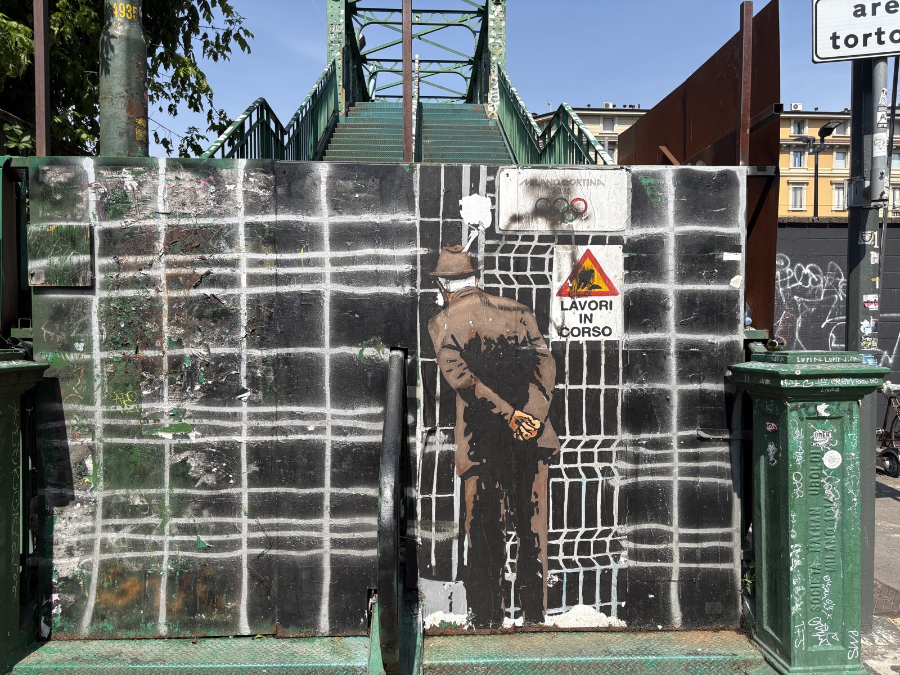

# Umarell 👴🏗️

> _An **umarell** is that retired Italian old man who spends his days watching construction sites, hands behind his back, commenting with an air of technical superiority._
>
> _L'**umarell** è quel vecchietto italiano in pensione che passa le giornate a osservare i cantieri, mani dietro la schiena, commentando con aria di superiorità tecnica._


<sub>📍 Ph. Adriano — Milano, Porta Genova</sub>

---

## 🌅 Why this exists / Perché esiste

**EN.** In a discussion with Dev, we realized that while AGI is on its way,
developer work has already started to look a lot like an old Italian man watching
a construction site — hands behind the back, mildly judgmental — while Claude
and Copilot do the actual job. So why not get prepared for what's coming, with
real construction sites already on screen?

**IT.** In una chiacchierata con Dev abbiamo capito che, mentre l'AGI sta
arrivando, il lavoro dello sviluppatore assomiglia già parecchio a un vecchietto
italiano che guarda un cantiere — mani dietro la schiena, vagamente critico —
mentre Claude e Copilot fanno il lavoro vero. E allora perché non prepararsi a
quello che sta per arrivare, con dei cantieri veri già a schermo?

---

## 🇬🇧 English

A VS Code extension that puts a live construction site webcam in your sidebar, with a tiny Italian old man underneath who watches it and mutters random comments while you code.

### Features

- 📷 **Live webcam panel** in the sidebar (Activity Bar → Umarell icon)
- 🔁 **Auto-refresh** every N seconds (configurable)
- 👴 **Animated umarell** with moustache and flat cap, swaying under the monitor
- 💬 **Random comments** ("Not enough mortar in there…", "Three workers and one shovel, classic")
- 🌍 **Bilingual** — comments in EN, IT, or both (auto-detects VS Code locale)
- 🏗️ **5 preset sites** + unlimited custom URLs
- ⚙️ **Fully configurable** via settings

### Local setup

```bash
cd ~/Projects/umarell
npm install
# To try it: open this folder in VS Code and press F5
# (it launches an Extension Development Host with Umarell loaded)
```

### Commands

- `Umarell: Pick site` — quick pick across presets + custom
- `Umarell: Add custom webcam` — name + URL
- `Umarell: Refresh now` — force image refresh

### Settings

| key | default | description |
|---|---|---|
| `umarell.selectedCamera` | `demo` | Active site ID |
| `umarell.refreshIntervalSeconds` | `30` | Image refresh (5–3600 s) |
| `umarell.commentIntervalSeconds` | `25` | How often he mutters (5–600 s) |
| `umarell.showComments` | `true` | Show/hide comments |
| `umarell.commentLanguage` | `auto` | `auto` \| `en` \| `it` \| `both` |
| `umarell.customCameras` | `[]` | Your added webcams |

### Adding a real webcam

Public Italian construction webcams change URLs often. To add a working one:

1. Find a **direct JPEG/PNG snapshot endpoint** (not an HTML page with an iframe)
2. Run `Umarell: Add custom webcam`
3. Paste the URL; use the `{ts}` placeholder for cache-busting if needed (e.g. `https://cam.example/snap.jpg?t={ts}`)

> 💡 HLS / MJPEG live streams are not supported yet — static snapshots only.

### Packaging

```bash
npm install -g @vscode/vsce
vsce package
# produces umarell-0.1.0.vsix → installable via "Install from VSIX"
```

### License

MIT — do whatever you want.

---

## 🇮🇹 Italiano

Un'estensione VS Code che mette un riquadro live con la webcam di un cantiere nella sidebar, e un piccolo vecchietto italiano che lo osserva borbottando commenti random mentre tu programmi.

### Funzionalità

- 📷 **Riquadro webcam live** nella sidebar (Activity Bar → icona Umarell)
- 🔁 **Auto-refresh** ogni N secondi (configurabile)
- 👴 **Umarell animato** con baffi e coppola che oscilla sotto al monitor
- 💬 **Commenti random** ("Eh ma la malta è poca…", "Tre operai per una pala…")
- 🌍 **Bilingue** — commenti in EN, IT, o entrambe (rileva la lingua di VS Code)
- 🏗️ **5 cantieri preset** + URL personalizzati illimitati
- ⚙️ **Tutto configurabile** dalle settings

### Setup locale

```bash
cd ~/Projects/umarell
npm install
# Per provarla: apri questa cartella in VS Code e premi F5
# (parte una Extension Development Host con Umarell caricato)
```

### Comandi

- `Umarell: Scegli cantiere` — quick pick fra preset + custom
- `Umarell: Aggiungi webcam personalizzata` — nome + URL
- `Umarell: Aggiorna ora` — forza il refresh dell'immagine

### Settings

| chiave | default | descrizione |
|---|---|---|
| `umarell.selectedCamera` | `demo` | ID del cantiere attivo |
| `umarell.refreshIntervalSeconds` | `30` | Refresh immagine (5–3600 s) |
| `umarell.commentIntervalSeconds` | `25` | Ogni quanto borbotta (5–600 s) |
| `umarell.showComments` | `true` | Mostra/nascondi commenti |
| `umarell.commentLanguage` | `auto` | `auto` \| `en` \| `it` \| `both` |
| `umarell.customCameras` | `[]` | Le tue webcam aggiunte |

### Aggiungere una webcam vera

Le webcam pubbliche di cantieri italiani cambiano spesso URL. Per aggiungerne una funzionante:

1. Trova un endpoint **snapshot JPEG/PNG diretto** (non una pagina HTML con iframe)
2. Esegui `Umarell: Aggiungi webcam personalizzata`
3. Incolla l'URL; usa il placeholder `{ts}` se serve cache-busting (es. `https://cam.example/snap.jpg?t={ts}`)

> 💡 Le webcam "live" basate su HLS/MJPEG streaming non sono supportate al momento — solo snapshot statici.

### Packaging

```bash
npm install -g @vscode/vsce
vsce package
# produce umarell-0.1.0.vsix → installabile con "Install from VSIX"
```

### Licenza

MIT — fai quel che ti pare. _Mo, l'è tutto da rifare comunque._

---

## 🤖 Built with

A **vibe-coded funny solution by [Adriano Fontanari](https://github.com/adrianofontanari)**,
crafted end-to-end with **Claude Opus** by [Anthropic](https://www.anthropic.com).
From the SVG umarell to the bilingual mutterings — every line written together
with Opus inside Claude Code.

_Una **vibe-coded funny solution di [Adriano Fontanari](https://github.com/adrianofontanari)**,
costruita interamente con **Claude Opus** di [Anthropic](https://www.anthropic.com).
Dall'umarell in SVG ai borbottii bilingue — ogni riga scritta insieme a Opus dentro Claude Code._
